# The cockpit in layers

**The first screen of a project should show four facts and one sentence, and everything else should be one click further down.** Today the first screen loads 772 KB of payload for this repository, leads with 148 historical transitions, and never lists the 18 issues waiting for triage. This note proposes five layers of data, says what each of the four flows shows at every layer, and offers three ways to get there. It is offered for Edwin's decision; nothing in it is built. Its home is [[PHASE-045-The-Cockpit-In-Layers]], opened as a place to refine it: the phase holds the five open decisions and a log, and one backlog feature per option ([[FEAT-0152-Home-First]], [[FEAT-0153-Flows-As-Views]], [[FEAT-0154-Subject-Threads]]).

The pictures are in `__attachments__/` beside this note. `DES-0015-the-cockpit-in-layers.html` is the page they were captured from, and it can be opened in the viewer to see the same plates in both schemes.

## Problem

Measured on 2026-09-17 against the sidecars the running shell had already started, plus a fresh sidecar of this repository for the screen captures. Nothing was written and nothing in the running window was touched.

### The first screen costs a lot and answers the wrong question

The overview fetches three payloads before it can draw. The whole picture of what needs a person is a fourth payload of about one kilobyte.

| payload | this repo | your-trainer | what the overview draws from it |
| --- | --- | --- | --- |
| `/api/cockpit/stats` | 399 KB | 636 KB | six count tiles, 46 phases, the focus band, weekly activity |
| `/api/cockpit/nav?mode=overview` | 297 KB | 346 KB | the left navigator (43 groups here, 30 there) |
| `/api/cockpit/digest` | 76 KB | 83 KB | the "since you looked" band (148 transitions here) |
| **first screen total** | **772 KB** | **1.06 MB** | |
| `/api/cockpit/obligations` | 1.1 KB | 1.2 KB | nothing on the overview; the four top-bar badges |

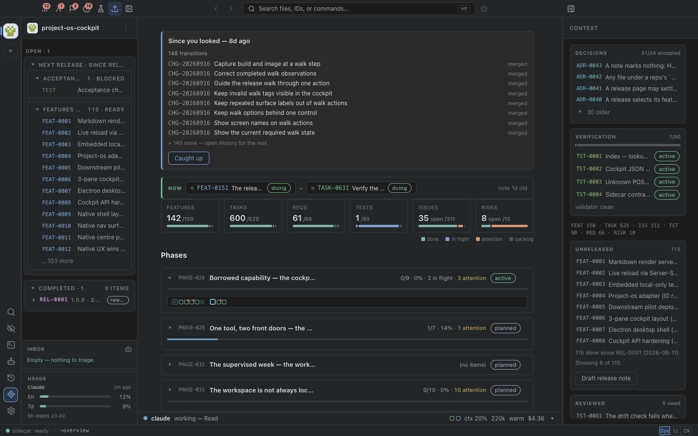

The overview as built. The "since you looked" band lists change notes, the tiles count everything that exists, and the phase accordion starts with an active phase at 0 of 9. The 33 obligations are the four red badges at the top left and appear nowhere on the page.

### What needs a person is split four ways and sorted wrongly

This repository owes 33 judgments: 18 issues to triage, 12 commits to push, 2 requirements to approve, 1 ADR to decide. Your-trainer owes 89. The digest's `needs_you` list puts the 12 unpushed commits first, each as its own row with its full commit message, ahead of the triage issues and the ADR. A push is one act on twelve commits; it is one row.

### The navigators show the archive

| navigator | this repo | your-trainer |
| --- | --- | --- |
| features: groups, of which phases, of which closed phases | 43 · 40 · 27 | 30 · 27 · 14 |
| issues: rows, severity groups listed twice (open, then fixed) | 293 · yes | 416 · yes |
| features: "Unattached tasks" rows | 2 | 177 |
| tests: outstanding named in the navigator against the page saying "Nothing owed" | 6 of 36 · yes | 267 of 268 · yes |

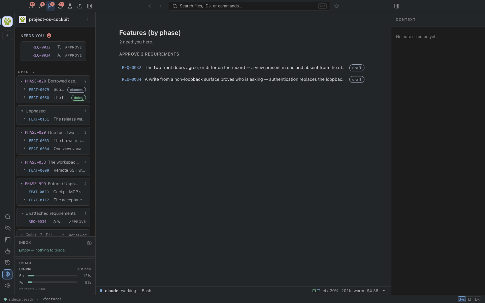

The features view. The two owed requirements are correct and first. Below them the navigator is the list of every phase the project ever had, and the page repeats the two requirements a second time.

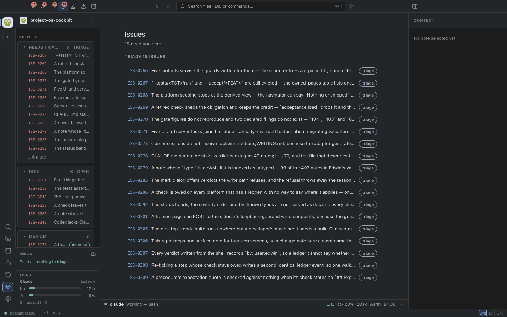

The issues view. Triage is first and right. The severity groups then run twice, once for open and once for fixed issues, and the page beside the navigator lists the same 18 triage rows again.

### A note opens on its frontmatter

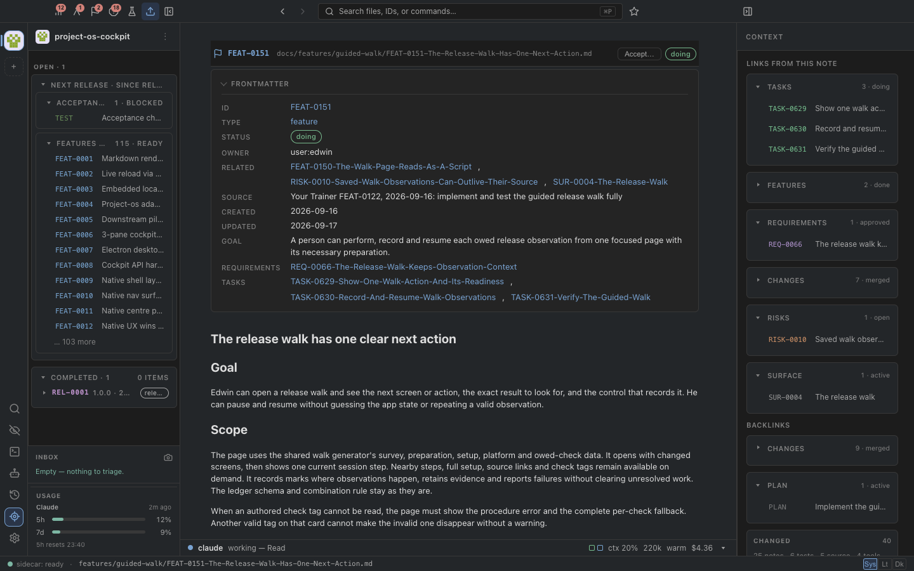

A feature as built. The reader who opens it is usually the person about to accept it or the person checking how far it is. The first screen is a 12-row table of fields; the goal sentence is row nine; there is no bar and no next action beyond the `Accept…` button in the header.

### A number that says something false

The overview's tests tile reads **1 / 90 passing**. Acceptance checks carry no `passing` status by decision ([[ADR-0038]]); their verdicts live in the ledger. The tile counts a status 34 of the 90 notes cannot have. `DESIGN.md` already states the rule this breaks: a number says what it counts.

### What yesterday's review already found

[[REFERENCE-FUTURE-COCKPIT-ENHANCEMENTS]] (2026-09-16) records eight findings and seven proposals from a walk through the same screens. This design does not repeat them. It turns proposals 1, 2, 5 and 6 into one model with a measured budget, and it keeps the preference recorded there: bars, percentages, colours and badges stay, and every one of them names its denominator.

## Approach

### What is borrowed, and from where

Apple's applications and the Claude and ChatGPT desktop apps are built on the same three habits, and the cockpit has each of them half-built.

1. **The first screen is a summary of what needs you, not an index of what exists.** Mail badges unread mail, never the size of the mailbox. The Health app's Summary is a handful of cards with one number each, and every card opens a page. The cockpit already has the count (the obligations registry) and the rule (ADR-0020); what it lacks is a first screen built from them.
2. **One unit in the sidebar, one unit on the stage.** Claude and ChatGPT list conversations by recency, show one conversation as a thread, and slide a panel in only when there is an artifact to show. The cockpit's unit is the subject: a feature, a design, an issue, a release. Today the sidebar lists notes by type and phase, and the stage shows a note as a file.
3. **The machine's work is folded.** Claude's desktop app collapses tool calls and reasoning under one line a person can open. The cockpit's agent strip, session pages, cost, context and cache temperature are the same material, and today they are always on screen.

Every rule below is one of those three habits applied to this record.

### Five rules

1. **Each layer shows one level.** A count opens a row, a row opens a page, a page hides the record behind a fold. No layer skips a level and no layer shows two.
2. **What needs a person outranks what exists.** Counts of obligations sit at layer 0 and 1. Counts of notes sit at layer 4.
3. **One primary action per row, and it is the registry's verb.** Triage, Push, Approve, Decide, Accept, Run, Test. Secondary actions sit behind one menu.
4. **The machine's work is folded by default.** Agent sessions, transitions, commits and validator warnings are one line each until opened.
5. **Empty is a sentence and unknown is a word.** Already this project's rule (`DESIGN.md`); restated because a layer model makes it easier to break, by folding a zero into a card that then looks fine.

### The five layers

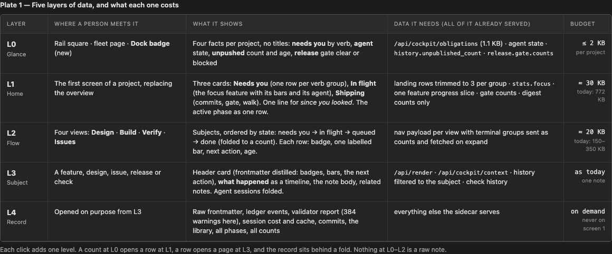

| layer | where | what it shows | budget |
| --- | --- | --- | --- |
| **L0 Glance** | rail square, fleet page, and a Dock badge (new) | four facts per project and no titles: needs-you by verb, agent state, unpushed count and age, release gate clear or blocked | under 2 KB per project |
| **L1 Home** | the first screen of a project, replacing the overview | three cards: Needs you, In flight, Shipping; one line for "since you looked"; the active phase as one row | about 30 KB, against 772 KB today |
| **L2 Flow** | four views: Design, Build, Verify, Issues | subjects ordered by state: needs you, in flight, queued, done folded to a count | about 20 KB per view, against 150 to 350 KB today |
| **L3 Subject** | a feature, design, issue, release or check | a header card with badges, bars and the next action; what happened as a timeline; the note; related notes | as today |
| **L4 Record** | opened on purpose from L3 | raw frontmatter, ledger events, validator report, session cost, commits, the library, all phases, all counts | on demand |

Every payload L0 to L2 needs is already served. L0 is the obligations payload plus three counts the history and release payloads already carry. L1 is the six landing payloads trimmed to three rows per verb group, the focus block of the stats payload, one feature's progress and the gate counts. L2 is the existing navigator payload with its terminal groups sent as counts and fetched when opened.

### The minimum up front

For one project, screen one needs these and nothing else:

| fact | source today | shown as |
| --- | --- | --- |
| what needs you, by verb | `obligations.breakdown` | one row per verb group, count, newest subject, the verb as the button |
| what is in flight | `stats.focus` plus that feature's task, criteria and check counts | one card, three labelled bars, the agent's state on one line |
| whether an agent is working, idle or waiting for input | agent state | a dot and a word on the In flight card |
| how far the work has travelled | `history.unpublished_count`, `release.gate.counts`, `release.status` | the Shipping card: commits unpushed with age, the gate blocked or clear with the owed count, the release test button |
| what happened while you were away | `digest.transition_count`, `digest.needs_you_count` | one sentence with a Caught up button; the list is a click away |

That is four facts and one sentence. For the fleet of 12 projects at L0 it is under 25 KB in total, and it is the same four facts per square.

### What this keeps

- The three panes, the top bar, the rail, the search, the capture action, the terminal and the agent strip. The strip's dot, agent name and current tool stay live; cost, context and cache temperature move to the record.
- Every registry verb and every write path. Nothing here adds a state, a status or a verdict a machine may write.
- [[ADR-0020]] (an obligation lives with its subject), [[ADR-0025]] (the Needs you group is a shortcut list that may repeat a row) and [[ADR-0028]] (three phases; an obligation is routed to the phase that owns its subject). Home's Needs you card is the shortcut list ADR-0025 permits, drawn once more on the landing page.
- The design system ([[DES-0002]]): the plates declare its tokens verbatim and add no colour.
- Bars, percentages, colours and badges, each with a label saying what it counts.

## The design

### Home

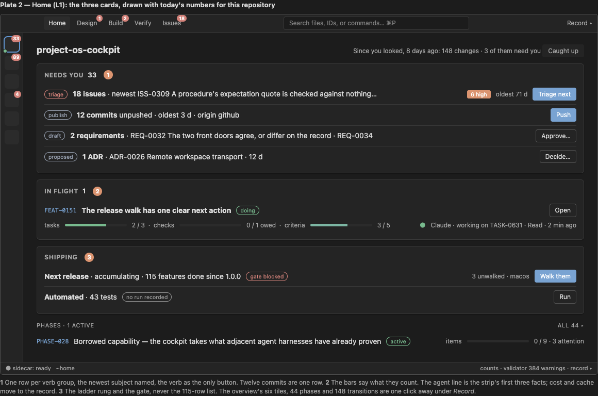

Home, drawn with today's numbers. Pin 1: one row per verb group, the newest subject named, the verb as the only button; twelve commits are one row. Pin 2: the In flight card's three bars say what they count, and the agent line carries the strip's first three facts. Pin 3: the Shipping card shows the ladder rung and the gate, never the 115-feature list. The overview's six tiles, 44 phases and 148 transitions are one click away under Record. The left pane is collapsed on Home, as it is on Apple's summary screens: a list beside a list of cards is two lists.

### The four flows, layer by layer

Each column is one of Edwin's four flows. Each row is a layer. A cell is what that flow shows at that layer.

| | Design and review | Implementation | Verification | Issues |
| --- | --- | --- | --- | --- |
| **subjects** | designs, ADRs, requirements at `draft` | features and their tasks; the agent working them | tests, acceptance checks, the release gate, the release test | issues |
| **L0 glance** | "Decide 1 · Approve 2" | agent dot and "1 in flight" | "gate blocked · 3" or "gate clear"; "Run 2" | "Triage 18" |
| **L1 home row** | one row per verb: the newest proposed design or ADR named, its age, revisions since it was offered; button Decide or Accept or Approve | the In flight card: the focus feature, badge, tasks bar, criteria bar, checks bar, the agent's state and last tool; button Open; amber with Answer when the agent waits for input | the Shipping card: next release and its gate with the owed count and platform, button Walk; automated tests with their last result or "no run recorded", button Run; commits unpushed with age, button Push | one row: count, how many high or critical, age of the oldest; button Triage next |
| **L2 flow view** | Awaiting you; Offered (proposed, with what changed since the last verdict); Drafting; Accepted and being built (with the feature's bar); Implemented folded; About this project (the standing documents) folded and last | Approve (requirements at draft, the design-to-build hand-off); Now; Next, grouped only by the active phase, other phases folded by name with counts; Done since the last release folded; "unattached" folded | This release (owed checks grouped by screen, a settled bar, Walk and Settle, coverage as one line with Commission checks); In flight (the focus feature's tests and their verdicts); Automated (last result); Retired folded | Triage queue; Open by severity as a stacked bar and the high rows first; Fixed since the last release folded; Deferred and Declined folded |
| **L3 subject** | pictures first, then the question the design asks, then Accept, Request changes, Decline; then what changed since your last look; then Problem and Approach; then Review; frontmatter folded | header card: goal sentence, badges, three bars, Accept or Run checks; What happened as a timeline with agent sessions folded; the note; Related | the release test page as built for a release and platform; a check's page: procedure, verdict history, evidence; the release page with the gate first and contents folded | header card: severity, status, affected surface, feature and check, age; the evidence; Accept for fixing, Defer, Decline, Duplicate of; Fix appears after acceptance; the note; the check that found it and the commit that fixed it |
| **L4 record** | the HTML page in the viewer, the raw note, the verdict history | session pages with cost, context and cache; the terminal; commits; files touched | ledger events, evidence images, the release test sheet, the validator report | the raw note; the rerun of the check |

### Build

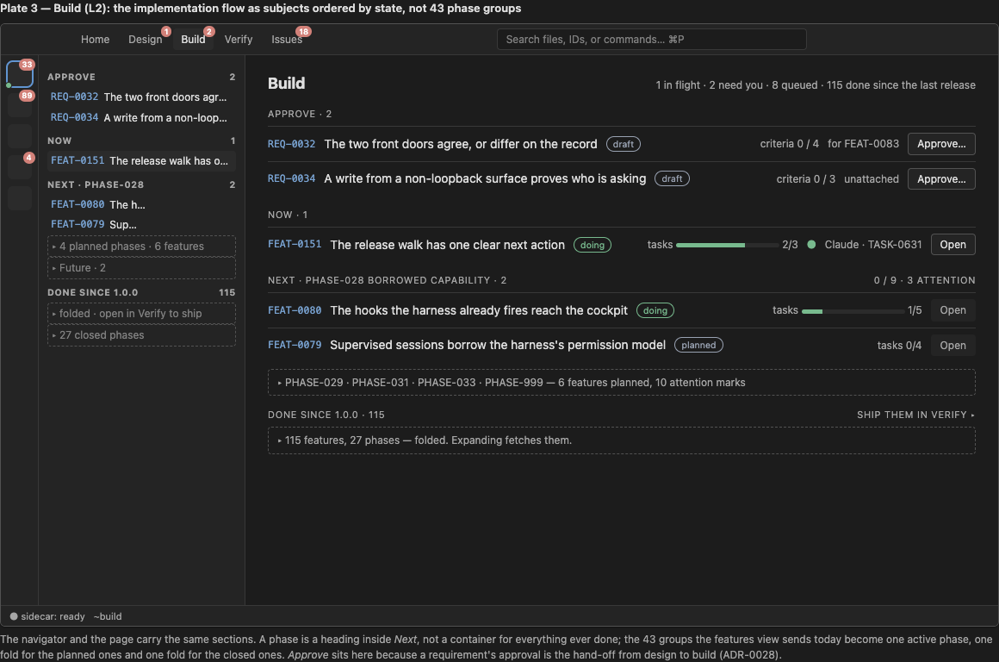

Build. The navigator and the page carry the same four sections in the same order. A phase is a heading inside Next, not a container for everything ever done: the 43 groups the features view sends today become one active phase, one fold for the planned phases and one fold for the 27 closed ones. Approve sits here because a requirement's approval is the hand-off from design to build.

### A feature

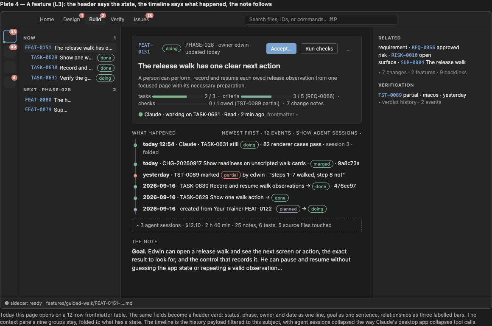

A feature. The twelve frontmatter rows become one header card: status, phase, owner and date on one line, the goal as one sentence, the relationships as three labelled bars and a count of change notes. The timeline is the history payload filtered to this subject, newest first, with the agent's sessions collapsed into one line the way Claude's desktop app collapses tool calls. The right pane keeps the context groups, folded to the ones with a state. The note body follows.

### Design and review through all four layers

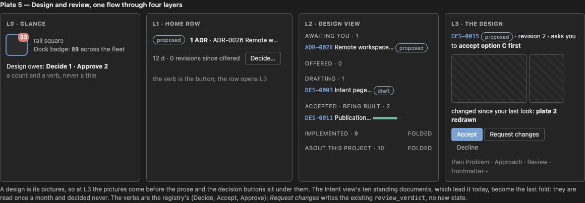

The design flow. A design is its pictures, so at layer 3 the pictures come before the prose and the decision buttons sit under them. The Intent view's ten standing documents, which lead it today, become its last fold: they are read once a month and decided never. The verbs are the registry's. Request changes writes the existing `review_verdict`; no new state.

### Triage

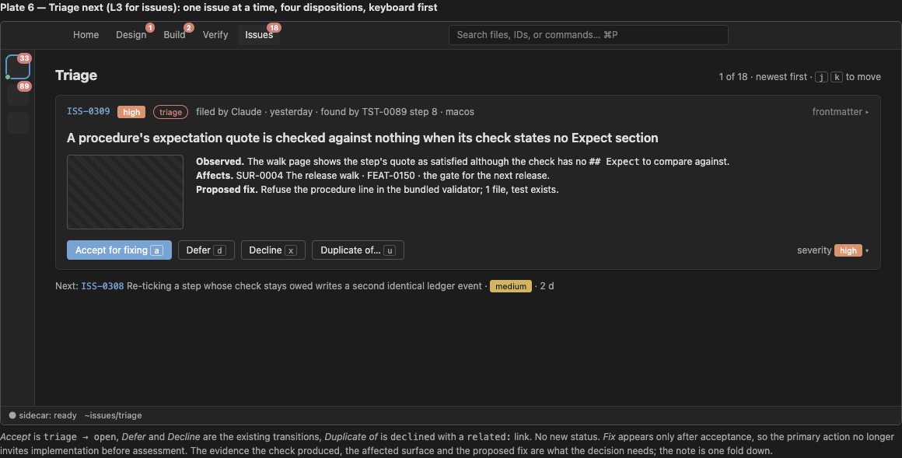

Triage, one issue at a time. Accept is `triage → open`, Defer and Decline are the existing transitions, Duplicate of is `declined` with a `related:` link. No new status. Fix appears only after acceptance, which answers yesterday's finding that the primary action on a triage issue invited implementation before assessment. The evidence the check produced, the affected surface and the proposed fix are what the decision needs; the note is one fold down.

### Verify

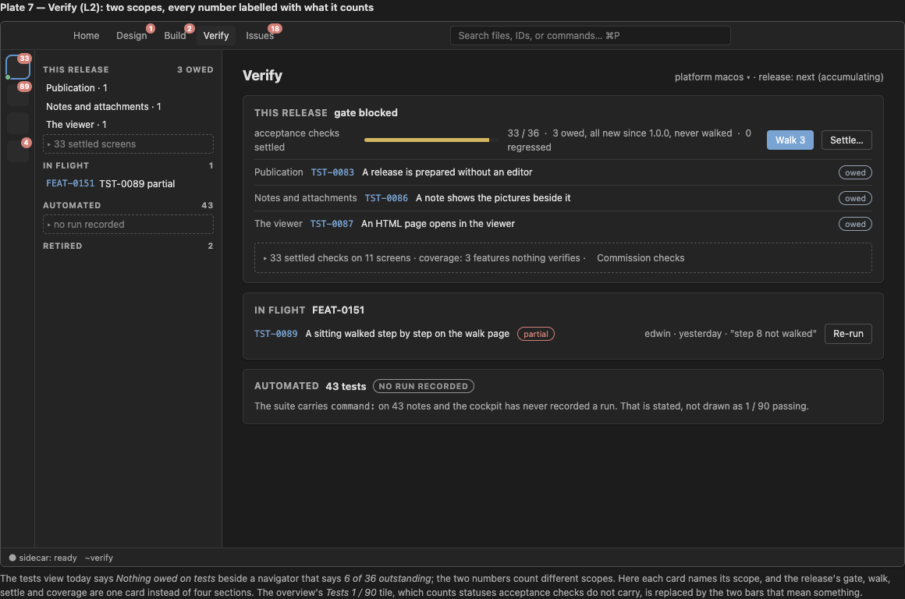

Verify. The tests view today says "Nothing owed on tests" beside a navigator saying "6 of 36 outstanding"; the two count different scopes. Here each card names its scope. The release's gate, release test, settle and coverage are one card instead of four sections. The overview's "Tests 1 / 90" tile is replaced by the two bars that mean something: checks settled for this release, and the automated suite's last recorded result, which here is honestly "no run recorded".

## Options

Three ways to reach the model. They are not exclusive; the recommendation is a sequence.

| | **C. Home first** | **A. Flows as views** | **B. Subject threads** |
| --- | --- | --- | --- |
| what changes | L0 and L1 only: a Dock badge and the rail square gain the four facts; Home replaces the overview's first screen; the overview's tiles, phases and history move under Record | L2: the navigator's modes become Home, Design, Build, Verify, Issues; each view's groups are ordered by state with terminal groups folded and fetched on demand | L3: a subject page with a header card, a timeline and folded agent sessions; the sidebar lists subjects by recency and need; the right pane slides in only for an artifact |
| what it costs | one composed payload of about 30 KB from payloads that exist; one page; the Dock badge is an Electron call | navigator payload changes in `cockpit.py` (state-first grouping, folded terminal groups); badge re-homing; the Publication view's decision reopened (see D2) | the largest renderer change of the three; history filtered per subject (the payload already carries ids); the context pane's groups reused |
| what it keeps | everything else exactly as built | Home from C; every page as built | Home and the flow views; the note renderer; every write path |
| risk | low; ADR-0025 already permits the shortcut list | medium; ADR-0028 gave publication its own view on 2026-08-16 and this folds its ladder into Home and Verify | medium to high; 23,000 lines of renderer, and the panel architecture in [[project-os-deck#REFERENCE-SURFACE-ARCHITECTURE-OPTIONS]] would host it more naturally |
| the test it must pass | Edwin names the next decision, the in-flight item and the release blocker within ten seconds of opening a project; screen one under 50 KB | a flow view's first screen shows no closed phase and no fixed issue unless opened; each view under 30 KB before a fold is opened | a feature's first screen shows its goal, three bars and its next action without scrolling; the frontmatter is not on screen one |

**Recommendation: C, then A, then B**, each shipped and tested alone. C is additive and reversible and delivers the whole of the "minimum up front" question. A is where the four flows become the navigation. B is where a subject reads as a thread. If B turns out to belong in Deck, C and A still stand, because they change payloads and one page rather than the pane grammar.

## Decisions asked of Edwin

- **D1. Does Home replace the overview, or sit beside it?** Recommended: replace. The overview's contents keep their pages under Record ("All phases", "Counts", "History"), so nothing is lost and screen one has one job.
- **D2. Do the four flows become the navigation, and where does the publication ladder live?** Recommended: Home, Design, Build, Verify, Issues, with commits and the release on Home's Shipping card and inside Verify's "This release" card. The alternative keeps Publication as a sixth view, as ADR-0028 decided. That ADR's reasoning (a Releases view is empty in nine of twelve repos, the ladder is universal) argues for the ladder living on Home, which every repo has.
- **D3. What does the Dock badge count?** Recommended: the fleet's needs-you total, 89 today, because the badge is the only layer 0 a person sees while the window is hidden. The alternative is the open project only.
- **D4. Is "Duplicate of" a disposition worth a button?** It is `declined` plus a `related:` link, no new status. Recommended: yes, because Linear's triage shows it is the second most used disposition after accept, and without it a duplicate is declined with no trace of what it duplicated.
- **D5. Do agent sessions fold by default on subject pages while the strip stays live?** Recommended: yes. The strip answers "is an agent working now"; the fold answers "what did it do", and the second question is asked far less often than the first.

## Out of scope

- The panel and window architecture, the 2D desk and the glass field. Those are Deck's ([[project-os-deck#REFERENCE-SURFACE-ARCHITECTURE-OPTIONS]]); this design changes payloads and pages, not the pane grammar.
- The sidecar's own tablet HTML (mode 1). ADR-0010 gates its parity on an authenticated write path, and nothing here changes that.
- Any new status, any new write path, any verdict written by a machine. Every button drawn here is a registry verb that exists.
- The Obsidian vault profile ([[ISS-0279]]).
- The record's own gaps. Home will say "no run recorded" for the automated suite and "no surface note" for a screen because those are true; making them false is not a presentation task.

## Revisions

- 2026-09-17 — first offer. Measured against this repository and your-trainer; seven plates and four as-built captures.
- 2026-09-17 — homed in [[PHASE-045-The-Cockpit-In-Layers]] on Edwin's instruction, with one backlog feature per option, so the proposal can be refined over time. No change to the plates.

## Review

Comments land here, each naming the plate or the decision it is about. Verdicts go in the frontmatter, transcribed from a review that actually happened.
