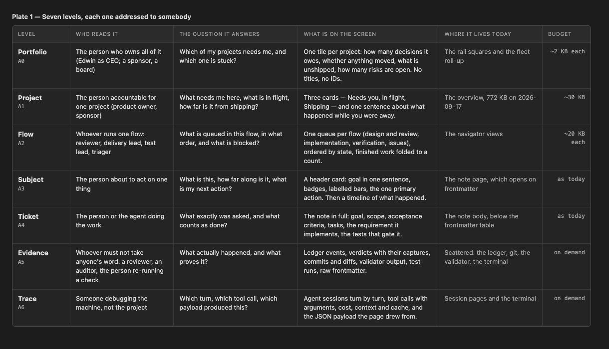
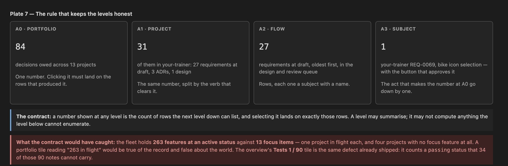
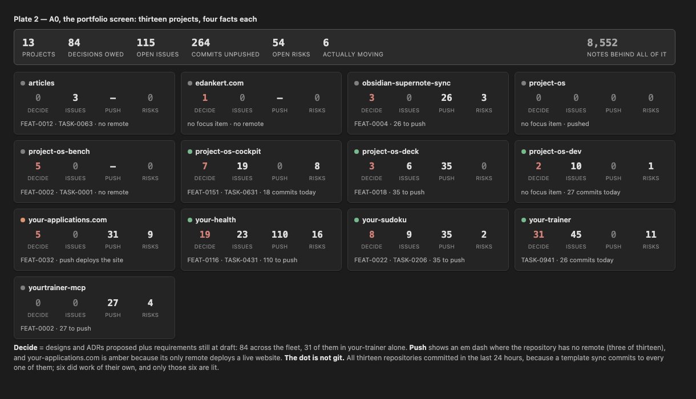
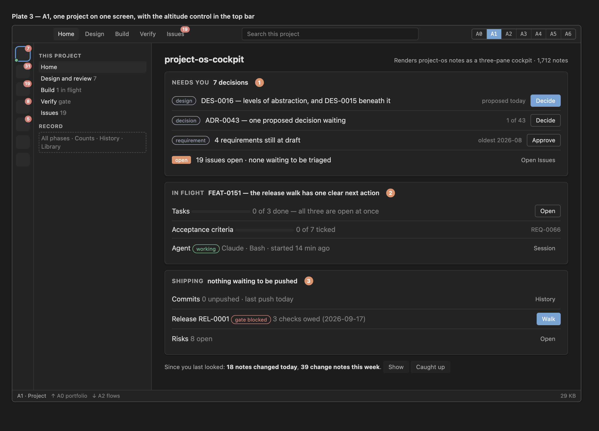
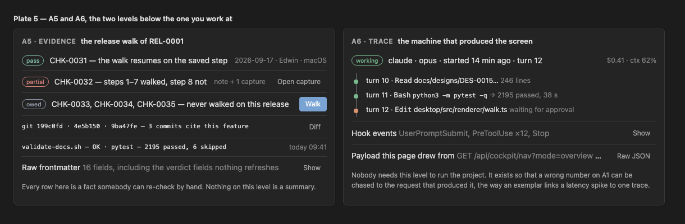
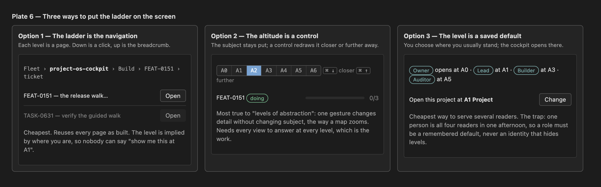

# Levels of abstraction

**The cockpit should answer one question per level, and a level should be defined by who is asking rather than by how many kilobytes it costs.** This note proposes seven such levels: the portfolio of thirteen projects, one project, one flow, one subject, the ticket in full, the evidence under it, and the agent trace under that. The top two are new. The bottom two exist in pieces nobody can reach from a page. It also proposes one rule that keeps them honest and three mechanics for putting them on screen, and it recommends one of the three.

Its home is [[PHASE-045-The-Cockpit-In-Layers]], which exists to refine this idea rather than to build it. Nothing here is built, and the phase's open decisions grow by five.

The pictures are in `__attachments__/` beside this note. `DES-0016-levels-of-abstraction.html` is the page they were captured from, and it opens in the viewer if you want to see them in the light scheme.

## Problem

### The proposal on the table cuts the material the wrong way

[[DES-0015-The-Cockpit-In-Layers]] proposed five layers — glance, home, flow, subject, record — and defined each one by its payload budget: about 2 KB, about 30 KB, about 20 KB, as today, on demand. That is a real improvement over a first screen of 772 KB, and its measurements stand. But a budget is not a reader. Nothing in that model says who layer 2 is for, and when a person asks "show me this project the way a sponsor would see it", the answer has to be reconstructed from three payload sizes.

Edwin's words on 2026-09-20 name the missing dimension: *levels of abstraction*, ordered so that each one "gets you closer to the real content, the full ticket content", with the top being the view of somebody overseeing every project at once and the bottom being lower than the level anyone needs to build with.

### The cockpit has no screen for the person who owns all thirteen projects

Measured across `~/Dev/repos` on 2026-09-20: thirteen repositories carry a `SNAPSHOT.yaml`, and behind them sit **8,552 Markdown notes**. There is a rail of squares and a fleet roll-up, and there is no screen that answers "which project needs me, and which one is stuck". The shell can open any one project; it cannot show thirteen at once as thirteen states.

The facts a person would want are all derivable today:

| fact, fleet-wide | 2026-09-20 | where it comes from |
| --- | --- | --- |
| decisions owed (designs and ADRs proposed, requirements at draft) | 84 | note frontmatter |
| issues open | 115, of which 1 is waiting to be triaged | note frontmatter |
| commits not pushed | 264, across six repositories | git |
| repositories with no remote at all | 3 | git |
| risks open | 54 | note frontmatter |
| repositories that committed in the last 24 hours | 13 | git |
| repositories that did work of their own in that time | 6 | git, minus the template sync |

The last two rows are the warning. Every repository committed today because a template sync commits to all of them, so **git activity is not a movement signal in this fleet** and a portfolio screen that lights up thirteen green dots would be telling a person nothing.

### A number that counts the record instead of the world

The same measurement found **263 features at an active status against 13 focus items** — one project in flight each, and four projects with no focus feature at all. Any portfolio tile that said "263 in flight" would be arithmetically correct and practically a lie. The cockpit has already shipped one number of this kind: the overview's **Tests 1 / 90** tile counts a `passing` status that 34 of those 90 notes cannot carry, because acceptance-check verdicts live in the ledger ([[ADR-0038]]).

### Below the working level there is no level, only tools

A reviewer who will not take the record's word for it needs the ledger events, the captures attached to a verdict, the commits that cite the feature, the validator's output and the test run. Those exist, in five different places, none of them reachable from the note that claims the work is done. Below that again is the machine: the agent's turns, its tool calls, its cost and context, and the JSON payload the page was drawn from. The sidecar holds all of it and no page presents it as a level.

## Approach

### What a level is

A level is **a reader and the question they are asking**. That is the C4 model's definition of an abstraction level, and its argument — tell different stories to different audiences, never one overloaded diagram — is exactly the problem here ([[REFERENCE-ABSTRACTION-LEVELS-SCAN]], family 2).

Payload size then follows from the level rather than defining it. DES-0015's budgets survive intact; they stop being the reason and become the consequence.

### Seven levels

The ladder. A0 and A1 are one screen each. A2 to A4 are where work is done. A5 and A6 are below the level anyone needs to drive the project, and they exist so that a claim can be checked and a machine debugged.

| level | reader | the question |
| --- | --- | --- |
| **A0 Portfolio** | whoever owns all of it — Edwin as CEO, or a sponsor, or a board | Which of my projects needs me, and which one is stuck? |
| **A1 Project** | the person accountable for one project | What needs me here, what is in flight, how far is it from shipping? |
| **A2 Flow** | whoever runs one flow: reviewer, delivery lead, test lead, triager | What is queued in this flow, in what order, and what is blocked? |
| **A3 Subject** | the person about to act on one thing | What is this, how far along is it, what is my next action? |
| **A4 Ticket** | the person or the agent doing the work | What exactly was asked, and what counts as done? |
| **A5 Evidence** | whoever must not take anyone's word: a reviewer, an auditor, the person re-running a check | What actually happened, and what proves it? |
| **A6 Trace** | someone debugging the machine, not the project | Which turn, which tool call, which payload produced this? |

Three of the seven are new work. A0 has no screen at all. A4 exists but is buried under a twelve-row frontmatter table. A5 and A6 exist as tools rather than as levels.

### Five rules

1. **Each level answers its own question completely.** A level is not a truncated version of the one below it; it is a whole answer at a greater distance.
2. **Each descent is Summary → Segment → Detail.** The dashboard literature's shape, and the one Shneiderman's mantra describes: overview first, zoom and filter, details on demand.
3. **A number resolves downwards** — see the contract below.
4. **A roll-up is computed, never typed.** Linear's initiative progress is a rendering of its issues; nothing in the cockpit should ask a person to maintain a status that the notes already imply.
5. **Health is a word, not only a bar.** A percentage says how far along; it never says whether anyone is worried. Linear's *On track / At risk / Off track* beside the bar is the cheapest fix and this record can derive it from the gate, the owed checks and the age of the focus item.

### The contract that keeps the levels honest

**A number shown at any level is the count of rows the next level down can list, and selecting it lands on exactly those rows.** A level may summarise; it may not compute anything the level below cannot enumerate.

This is the observability world's exemplar generalised: an aggregate metric carries a pointer to one trace, so a spike opens the request that caused it. Here it means 84 decisions owed at A0 opens 31 in your-trainer at A1, which opens the 27 draft requirements at A2, which opens `your-trainer REQ-0069` at A3 with the button that approves it — the act that takes the 84 down to 83.

The rule is also a test the existing surface fails, which is why it is worth writing down: **Tests 1 / 90** cannot be resolved into 90 rows that could each be passing, so under this contract it could never have been drawn.

## The design

### A0 — the portfolio

The portfolio screen, drawn from the fleet as it stood on 2026-09-20. Each tile carries four counts and one line; no titles and no note IDs, because the name of a thing is one level down. Every number counts something a person must do rather than something that exists.

Three details in the picture are the argument for measuring before designing. `your-applications.com` is amber because its only remote deploys a live website, so its 31 unpushed commits are not a chore anyone should be nudged to clear. Three repositories show an em dash under **push** because they have no remote at all. And only six dots are lit, although all thirteen repositories committed today: the template sync commits everywhere, so the movement signal has to come from the project's own focus item and its own work, not from `git log`.

### A1 — one project

One project on one screen. The three cards are DES-0015's and they are kept as they were: what needs you by verb, what is in flight with its bars, how far the work is from shipping.

Two things are added. The **altitude control** in the top right says which level you are standing at and moves you without changing the subject. The footer names the level and its two neighbours, so "up" and "down" are always visible even when the control is not in use. Every bar names its denominator, which is how the In flight card can honestly read *0 of 3 tasks done* and *0 of 7 criteria ticked* for FEAT-0151 — all three of its tasks are open at once, which is a fact worth seeing rather than an empty bar to hide.

### A2 to A6 — one subject at five distances

The descent, and the heart of the proposal. The subject never changes; only how close you stand to it.

A2 is the queue it sits in. A3 is the card that says how far along it is and what to do next. **A4 is the ticket itself** — the goal sentence, the scope, the seven acceptance criteria, the requirement, the surface — which is what Edwin means by the real content. A5 is the evidence that any of it is true. A6 is the machine that produced the screen.

A person driving the work lives at A3 and A4 and visits the others. That is the sentence the whole ladder exists to make possible.

### A5 and A6 — the two levels below the working level

Evidence and trace. A5 answers *prove it*: the ledger verdicts with their captures, the commits that cite the feature, the validator and suite results, and the raw frontmatter including the review fields nothing refreshes. Every row is a fact somebody can re-check by hand; nothing on that level is a summary.

A6 answers *which turn produced this*: the agent's tool calls with their results, the hook events, the cost and context, and the JSON payload the page was drawn from. The agent-observability tools have settled on exactly this shape — a session of turns, each tool call with name, arguments, result and latency, replayable — and the sidecar already records the material ([[REFERENCE-ABSTRACTION-LEVELS-SCAN]], family 6).

Neither level is ever on screen by default. Both are reached on purpose, and A6 is the level that makes a wrong number chaseable to the request that produced it.

### The four flows at every level

Edwin's four flows are the columns; the levels are the rows. A cell says what that flow shows at that level.

| | Design and review | Implementation | Verification | Issues |
| --- | --- | --- | --- | --- |
| **A0 portfolio** | "Decide 3" on the tile | the dot: working, idle, waiting | "gate blocked" or "clear" | "Triage 1" |
| **A1 project** | the Needs you card, one row per verb | the In flight card with three labelled bars and the agent's state | the Shipping card: gate, release test, commits | one row: count, severity mix, age of the oldest |
| **A2 flow** | Awaiting you, Offered, Drafting, Accepted; implemented folded | Now, Next by active phase, other phases folded, done folded | this release's owed checks by screen; the feature's tests; automated last result | triage queue, then open by severity, fixed folded |
| **A3 subject** | the design: pictures, the question, Accept / Request changes / Decline | the feature card: goal, bars, next action, timeline | a check: procedure, verdict history, evidence | the issue card: severity, surface, age, dispositions |
| **A4 ticket** | the design's prose and its revisions | the note in full: scope, criteria, tasks, requirement | the check's authored setup, steps and expectations | the issue's reproduction and its proposed fix |
| **A5 evidence** | the verdict history and what changed between offers | the commits, the diffs, the test runs | ledger events and captures | the check that found it, the commit that fixed it |
| **A6 trace** | — | the agent session that wrote it | the release test sheet the generator produced, and the payload | the session that filed it |

### Three ways to put the ladder on screen

**Option 1 — the ladder is the navigation.** Each level is a page; down is a click and up is the breadcrumb. It is the cheapest, it reuses every page as built, and DES-0015's three features already describe most of it. Its weakness is that the level is implied by where you are, so nobody can ask for a subject *at* a level.

**Option 2 — the altitude is a control.** One control, plus a keyboard pair, redraws the current subject closer or further away without changing what you are looking at. This is the mechanic that matches the words "levels of abstraction" most exactly, and the one that makes A0 and A4 reachable from anywhere. Its cost is that every view must answer at every level, which is the actual work of the proposal.

**Option 3 — the level is a saved default.** You choose where you usually stand — Owner at A0, Lead at A1, Builder at A3, Auditor at A5 — and the cockpit opens there. It is the cheapest way to serve several readers, and the trap is well documented: one person is all four readers in a single afternoon, so a role must be a remembered starting point and never an identity that hides levels.

**Recommendation: 1, then 2, then 3.** Build the pages, because they exist in some form already and each can ship alone. Add the control across them once more than one level is real. Add the saved default last, as a preference, when there is something to prefer.

### What this costs, and what already exists

| level | what has to be built | data |
| --- | --- | --- |
| A0 | a new screen, and a per-workspace summary the shell composes from the sidecars it already runs | exists; needs one small roll-up endpoint or a shell-side composition |
| A1 | Home, as DES-0015 describes it | exists across six payloads |
| A2 | state-first grouping in the navigator, terminal groups folded and fetched on demand | exists; the nav payload changes shape |
| A3 | a header card distilled from frontmatter, plus a timeline filtered to the subject | exists; the history payload already carries the ids |
| A4 | nothing new — the note body, once the frontmatter table is folded above it | exists |
| A5 | one page that gathers the ledger, the commits, the validator and the runs for one subject | exists in five places |
| A6 | the session as a trace, and a raw-payload view | exists in the sidecar |

No new status, no new write path, no verdict written by a machine. Every button drawn in the plates is a registry verb that exists today.

## How this relates to DES-0015

DES-0015 is not wrong; it is cut along a different axis, and its measurements are the evidence base for this note.

- **Its five layers map onto this ladder.** L0 becomes A0 and A1's glance, L1 is A1, L2 is A2, L3 is A3, and L4 splits into A4, A5 and A6 — which is the part of Edwin's ask that a single "record" layer cannot express.
- **Its three features survive.** [[FEAT-0152-Home-First]] is A1, [[FEAT-0153-Flows-As-Views]] is A2, [[FEAT-0154-Subject-Threads]] is A3 and A4. This note adds A0 above them and A5 and A6 below, and adds the contract and the altitude control across them.
- **Its five decisions stand**, and D2 in particular is unchanged: where the publication ladder lives is still open.

The proposed disposition, which is Edwin's to make and is listed as D6 below: accept this note as the model, keep DES-0015 as the measured problem statement, and mark it `superseded_by` this note only if Edwin agrees the model replaces it rather than extends it. Nothing is superseded by an author deciding it.

## Decisions asked of Edwin

These continue the numbering in [[PHASE-045-The-Cockpit-In-Layers]], which carries D1 to D5 from DES-0015.

- **D6. Is the ladder cut by reader, or by data?** Recommended: by reader, as here, with DES-0015's budgets kept as consequences. If yes, does DES-0015 become `superseded_by` this note, or do both stand?
- **D7. Which mechanic, and in what order?** Recommended: pages first, then the altitude control, then a saved default. The alternative worth considering is building the control first, because it forces every view to state its level and would otherwise be retrofitted.
- **D8. Does A0 get its own screen, and what are its four facts?** Recommended: yes, and *decisions owed · issues open · commits unpushed · risks open*, with a movement dot that comes from the project's own focus item rather than from git. The alternative is to grow the rail squares and skip the screen.
- **D9. How far down does the cockpit go?** Recommended: A5 in this cockpit, because checking a claim is what this record is for; A6 in this cockpit too, but folded and reached only from a subject. The alternative is that A6 belongs in Deck, or in the terminal where it already lives.
- **D10. Is the drill-down contract a rule with teeth?** Recommended: yes, as an ADR, so that a number nobody can resolve downwards is a defect and not a style preference. It would immediately fail the **Tests 1 / 90** tile, which is the point.

## Out of scope

- The panel and window architecture, the 2D desk and the glass field. Those are Deck's ([[project-os-deck#REFERENCE-SURFACE-ARCHITECTURE-OPTIONS]]); this design changes payloads and pages.
- Any new status, any new write path, any verdict written by a machine.
- The sidecar's own tablet HTML (mode 1), whose parity [[ADR-0010]] gates on an authenticated write path.
- Repairing the record. A0 will show "no focus item" for four projects and A5 will show "no run recorded" where that is true, because it is true.
- Multi-user concerns — permissions, who may see whose activity. This fleet has one person, and the levels here are cut by question rather than by clearance.

## Revisions

- 2026-09-20 — first offer. Seven plates, measured across all thirteen repositories, with the market scan in [[REFERENCE-ABSTRACTION-LEVELS-SCAN]].
- 2026-09-20 — plates re-captured at real size on Edwin's word that they were too big. They were taken at twice the screen's scale, so a 1,160-pixel-wide plate arrived as a 2,440-pixel image; they are now 1,220 pixels wide (1,460 for the five-panel plate 4), which matches DES-0015's, and the seven files together dropped from 1.5 MB to 620 KB. Nothing in the pictures changed.

## Review

Comments land here, each naming the plate or the decision it is about. Verdicts go in the frontmatter, transcribed from a review that actually happened.
