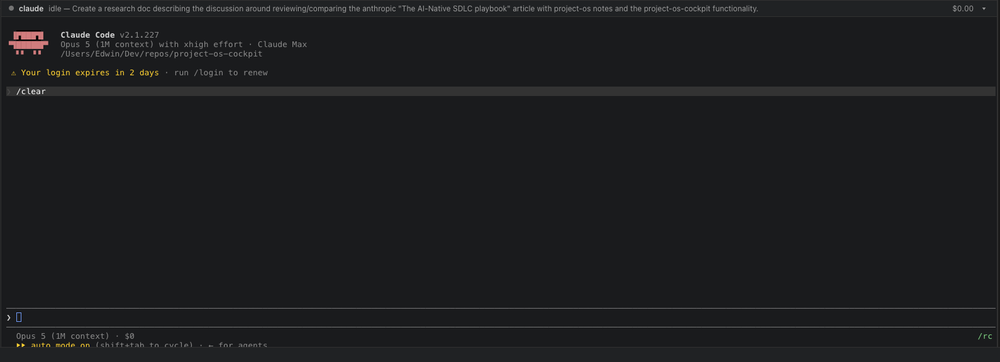

# The console clips its last line

## Problem

The bottom line of whatever is running in the desktop shell's console is cut through the middle of its glyphs. Reported 2026-08-25 with a screenshot of a Claude Code session: the model line renders, and the `auto mode on (shift+tab to cycle) · ⏎ for agents` line below it is sliced horizontally about two-thirds down.



The same screenshot shows the horizontal half of the same defect: Claude Code's right-aligned hint is cut off at the right edge of the pane.

This is **not** [[ISS-0016]] recurring. That was a *stale* geometry — xterm keeping a row count from a size the mount no longer had, fixed by the `ResizeObserver` in [[TASK-0185]]. This one is present in a freshly-fitted terminal: the fit itself is wrong, every time, by a fixed number of pixels.

## Root cause

`@xterm/addon-fit` sizes the terminal from its parent element:

```js
const i = window.getComputedStyle(this._terminal.element.parentElement);
const o = parseInt(i.getPropertyValue("height"));      // parent height
...
const l = o - (paddingTop + paddingBottom);            // MINUS THE XTERM'S OWN padding
rows: Math.max(1, Math.floor(l / cellHeight))
```

The padding it subtracts is the **xterm element's**, not the parent's. That is correct under CSS's default `box-sizing: content-box`, where `getComputedStyle(parent).height` reports the content box and the parent's own padding is already excluded.

`base.css` sets `* { box-sizing: border-box; }` for every element — it is shared with mode 1 and copied into the renderer by `desktop/scripts/copy-assets.mjs`. Under `border-box`, `getComputedStyle(parent).height` reports the **border box** — padding included. `.terminal-mount` carries `padding: 6px 8px`, so the addon believes it has 12px more vertical and 16px more horizontal room than the `.xterm` child (`height: 100%`) can ever occupy, and asks the PTY for rows and columns that do not fit. `.terminal-mount { overflow: hidden }` then cuts them.

The clipped amount is `rows × cellHeight − availableHeight`, which varies with the pane height — which is why it reads as intermittent. Measured against the real stylesheet and the real xterm build, at 13px font (15px cells) over pane heights 120–700px:

| | heights that clip a row | worst clip | widths that clip a column | worst clip |
|---|---|---|---|---|
| as shipped | **466 of 581** | 12px of a 15px row | **581 of 581** | 16px (~2 columns) |
| padding moved off the fit parent | 0 | 0 | 0 | 0 |

The vertical defect misses ~20% of pane heights by luck — the leftover happens to be under one row. The horizontal defect fires at **every** width, because 16px is always more than two 7.8px columns.

## Repro

Open the console in the desktop shell, run anything that draws to the bottom row (`claude`, or `printf '%s\n' {1..80}`), and drag the divider through a range of heights. The final row is cut for most of them.

## Expected

The terminal is exactly as many rows and columns as fit inside the mount. Nothing is clipped at any pane size.

## Actual

xterm is sized to the mount's border box; the last row and the last two columns fall outside the visible area and `overflow: hidden` removes them.

## Fix

[[TASK-0577]]: move the 6px/8px inset from `.terminal-mount` to `.terminal-pane`. The element xterm is opened into then carries no padding, so its border box and content box are the same box and the addon's measurement is exact. Geometry is unchanged pixel for pixel — the xterm keeps the same rect and the divider the same position — because the pane's padding removes exactly what the mount's padding used to.

Rejected: `box-sizing: content-box` on `.terminal-mount`. It also measures correctly, but it repairs the symptom in the harder-to-read direction — a reader has to know which box `getComputedStyle` reports before the line makes sense, and a future tidy-up that re-normalises the rule reintroduces the bug silently.

## Evidence

- `desktop/node_modules/@xterm/addon-fit/lib/addon-fit.js` — `proposeDimensions()`, the `parseInt(getComputedStyle(parent).height)` call.
- `src/project_os_cockpit/static/base.css` — the global `border-box`.
- `desktop/src/renderer/renderer.css` — `.terminal-mount { padding: 6px 8px; overflow: hidden }`.
- Measured in Chrome against the built `xterm.js` + `renderer.css` with a throwaway probe page, sweeping 581 pane heights and 129 widths. Numbers in the table above.

## Next Actions

- [x] Move the inset off the fit parent ([[TASK-0577]])
- [x] Pin the invariant so the padding cannot come back ([[TST-0078]])
