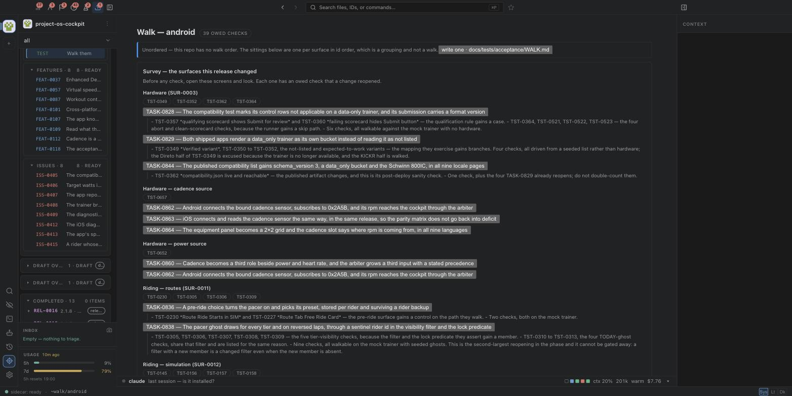

<!-- `issues:` is empty on purpose: a check naming an `ISS-*` reads as a claim
     about a past defect, and this is a behaviour claim about a new surface
     (ADR-0039 decision 4, `acceptance.section_of`). -->

# The walk page hands over the owed checks

## Setup

A repo with an open release, a ledger for that release's platform, and at least one owed manual check. `your-trainer` is the corpus this was built against: an Android release in preparation, 39 owed checks at the time of writing, and no `WALK.md` yet — so it exercises the fallback order and this repo exercises the authored one.

The shell must be running current code. A sidecar never re-imports, so restart it after any Python edit: a stale sidecar has produced a false reading twice in this project's history.

## Steps

1. Open the publication view on a repo with a release in preparation. **The release's Acceptance tests group carries a `Walk them` row saying how many are owed, on which platform.** Click it.
2. **The walk opens, and stays open.** The page is `~walk/<platform>`; the publication landing does not paint over it.
3. **The survey is the first section.** It names the surfaces whose owed checks a change reopened, each with the change or task that reopened it. Where a repo has none, it says so rather than showing an empty box.
4. **Every owed check is on the page exactly once**, grouped into sittings. Count them against the header's number.
5. **A sitting says what state it needs and what is on the bench**, where the walk order states them.
6. **A row carries the check's setup, steps and expected result.** A note that states none says so and offers the note.
7. **Tick a row.** The mark dialog opens with all seven marks and the check's own words.
8. **The row keeps its place**, the page does not scroll, and no other row moves.
9. Open `~checks` and the release page. **Both show the verdict just recorded.** There is no second store and no second write path.
10. Leave the project and come back. **The walk is where you left it.**
11. On a repo with no `WALK.md`, open its walk. **It says its order is nobody's, and offers the template to copy.** It is never blank.
12. Ask for `~walk/andriod`, and for the union. **Both are refused, and the refusal names the platforms that exist.**
13. Run every detection command in `docs/reference/cockpit-capability-register.md` for the walk's rows. **Each does what its row says.**

## Expect

A person preparing a release opens one page and knows what to do next, in order, with the procedure in front of them, and every tick lands in the ledger the gate reads.

## Evidence

Per step: date, window or harness, and what was on screen. A step walked in the harness rather than the running window says so — a sequence read across a window somebody else is driving is not evidence.

## Walked 2026-09-13 (model:claude-opus-5) — partial

Walked in the live harness on the built renderer, against two sidecars: one on this repo's `docs/` and one on `../your-trainer/docs`. **Not in Edwin's running window**, which two other agent sessions were driving at the time; a sequence read across a window somebody else is moving is not evidence.

1. **The ladder carries the row.** On `your-trainer`'s publication view, the Acceptance tests group holds `Walk them` — *"39 owed on android — the checks in walking order, each with its setup, steps and expected result"* — at `~walk/android`. Clicking it opened the walk. The number is the walk's own: the row above it says 327, which is the union across both ledgers, and the two would have disagreed a click apart if this row had read it.
2. **The walk opened and stayed open.** `currentRel` is `~walk/android`, the publication landing did not paint over it, and `~walk` is in `VIEW_OWNED_PAGES` so reselecting the view does not evict.
3. **The survey is the first section** — six surfaces on `your-trainer` (Hardware, Hardware — cadence source, Hardware — power source, Riding — routes, Riding — simulation, Workouts — execution), each naming the tasks that reopened it (`TASK-0828`, `TASK-0829`, `TASK-0844`, `TASK-0860`, `TASK-0862`, `TASK-0863`, `TASK-0864`, `TASK-0836`, `TASK-0838`, `TASK-0825`, `TASK-0824`) with their titles and their quoted `## Acceptance checks reopened` text. Five of the six resolve a `SUR-*` note. On this repo the survey is empty and says so. Compared against `ledger.events_by_check` by test, not by eye (`tests/test_walk_survey.py`).
4. **39 rows, no duplicates**, against a header reading `39 owed checks`. Asserted on the ids in the DOM, not on the count.
5. **State and bench render** on this repo, whose `WALK.md` states them: three sittings in file order, each with its state, and the bench item under sitting 1.
6. **A row carries the procedure.** `TST-0088`'s own row shows its Setup, Steps and Expect in full, with no "missing" line and no extra button. On `your-trainer`, where 53 of 61 rows have no headings, the rows say *"Steps: no heading"* and print the note's prose.
7. **The tick opened the dialog** with all seven marks and the check's rendered body above them; `partial` required a reason before Save was enabled.
8. **The row kept its place.** Scroll 1750 before and after; the four row ids in the same order; the ticked row re-drawn in place.
9. **One write path.** `docs/releases/ledgers/WORKING-macos.json` holds the event; `/api/cockpit/acceptance` reports `TST-0088` at `partial` with the same comment; the gate no longer lists it; the walk drops to three rows.
10. **The place is kept** — `cockpit:walk-place:ws1` holds `~walk/macos`, and the publication landing restores it when a workspace is reopened with nothing else in flight.
11. **`your-trainer` has no `WALK.md`** and got the banner: *"Unordered — this repo has no walk order…"* with a button opening `docs/__templates__/walk.md`. Never blank.
12. **Refusals.** `?platform=all` → 400, *"a walk is on one platform. Ask for one of: macos"*. `?platform=macs` → 400 naming the platforms that exist.
13. **Not walked.** The register's detection commands for the walk rows are written in the same commit as this walk, so there was nothing to run them against. This is why the verdict is `partial`.

**Two defects found and fixed during the walk**, each with a test that fails without the fix:

- A check that **does** state its Setup was told *"Setup: not stated"*. One sentence was doing two jobs — *the note has none*, and *this is not the heading that was asked for* — and the row printed the first under text that contradicted it. Three of this repo's four owed rows showed it.
- The row a walker had just ticked kept its `[ ]` glyph — *nobody has walked this* — because a clearing verdict removes the check from `ledger.owed`, and so from the payload the repaint fetches. The verdict now travels with the repaint and the row is redrawn with it.

A third was found earlier, in the node suite rather than here: the unordered banner lost its sentence when its button was appended, because the text was assigned to the banner's own `textContent`.
